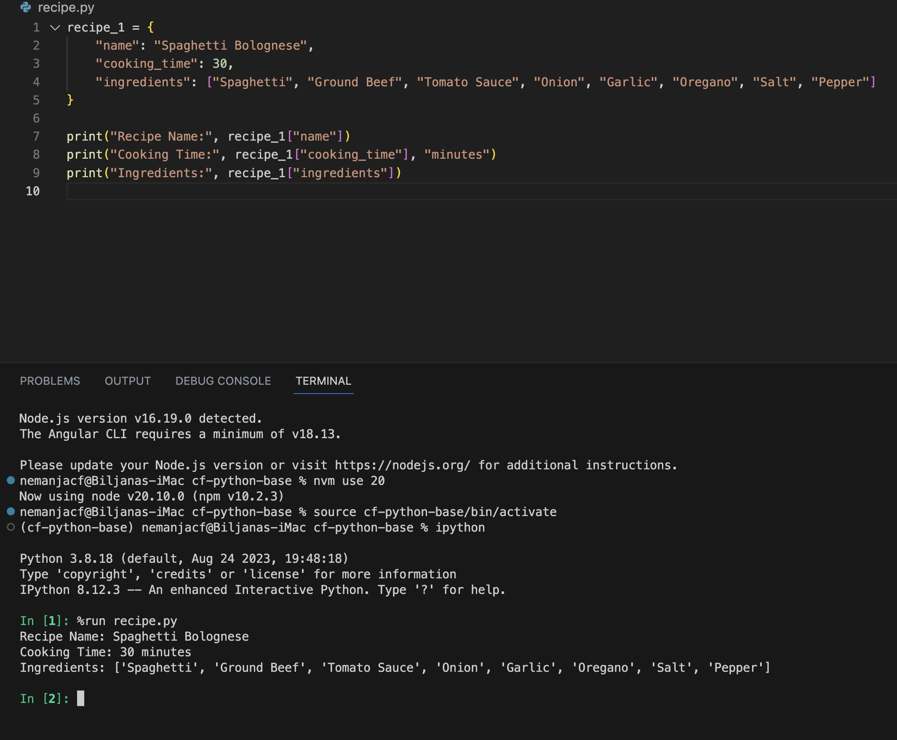
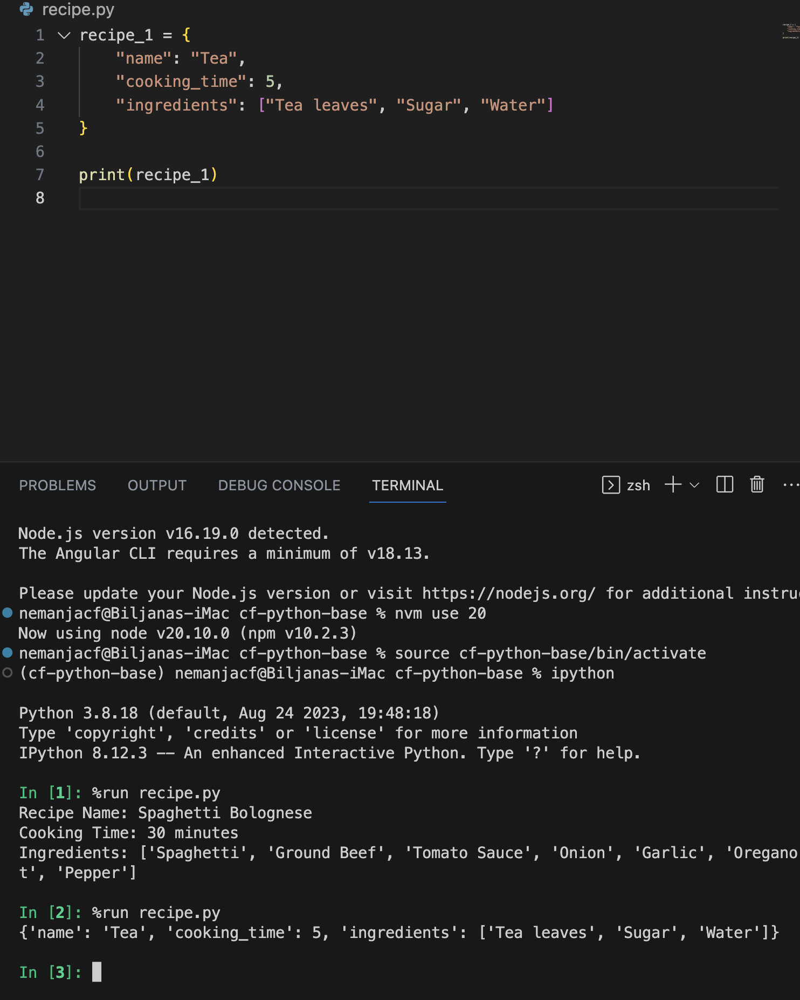
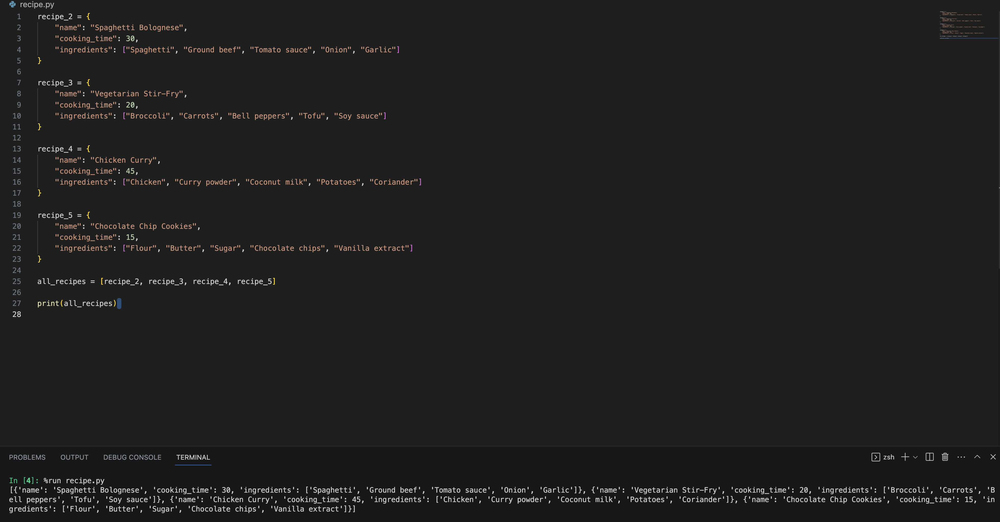
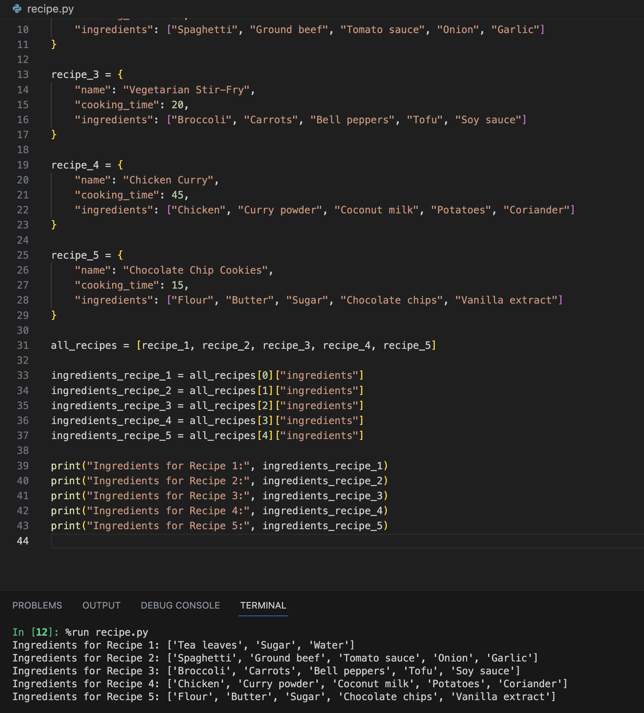

In this project, I've chosen to use a dictionary to represent each recipe, with keys such as "name," "cooking_time," and "ingredients." The flexibility of dictionaries allows for easy retrieval and modification of recipe details. To store multiple recipes, I've organized them sequentially in a list of dictionaries. This choice ensures a clear and accessible structure, facilitating efficient management of recipe information. 

Considering the need for sequential storage of multiple recipes, I have chosen a list as the outer structure (all_recipes). Lists provide a flexible and efficient way to organize recipes, allowing for easy addition, modification, and access of individual recipes within the sequence.

First task

Second task

Third task

Fourth task
